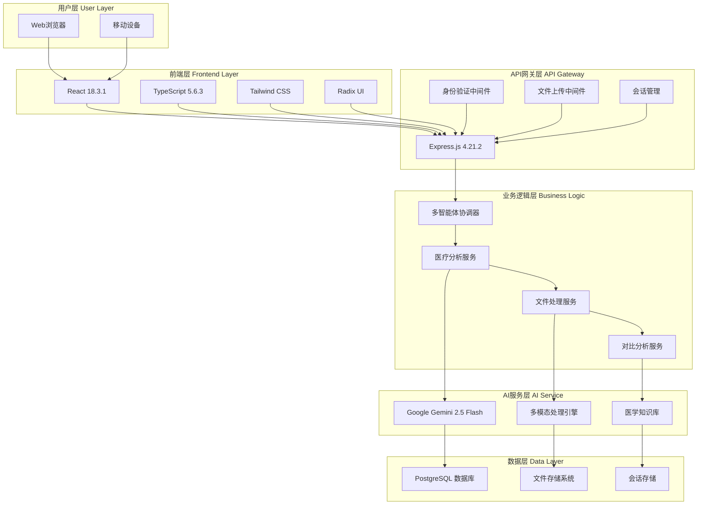
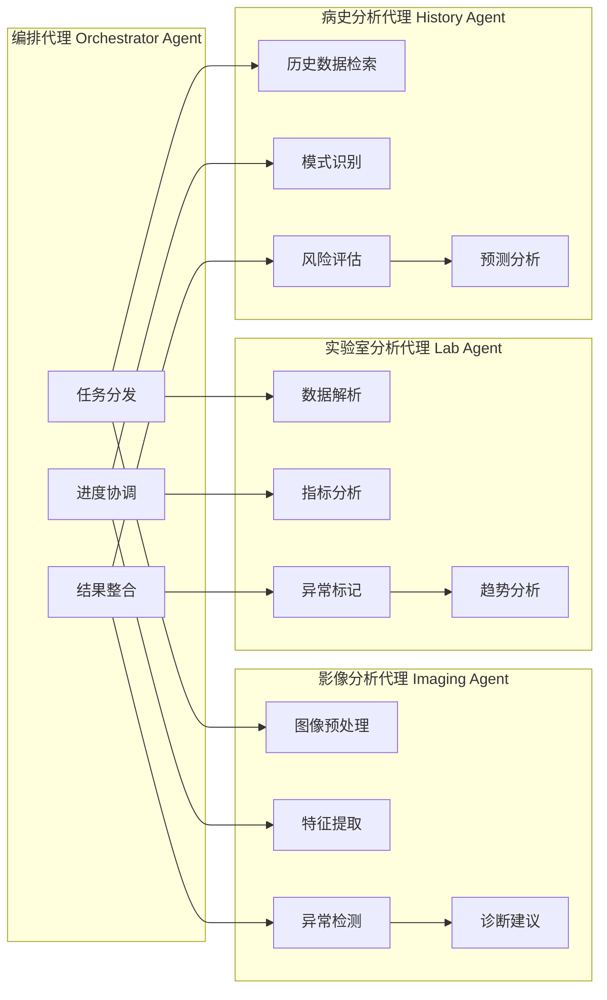
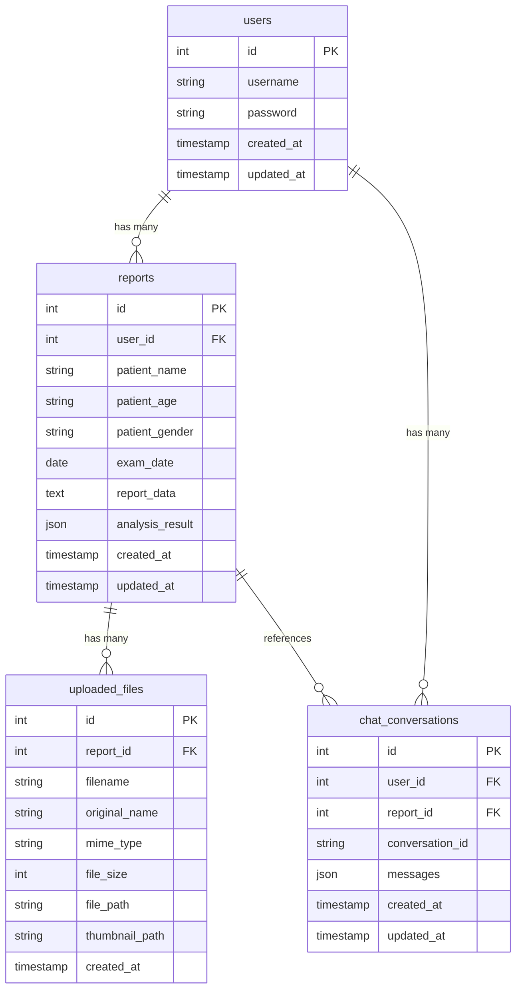

# 🔧 Med Agentic-AI 技术指南

## 📋 目录

- [系统架构设计](#系统架构设计)
- [多智能体系统](#多智能体系统)
- [API接口文档](#api接口文档)
- [数据库设计](#数据库设计)
- [前端架构](#前端架构)
- [后端架构](#后端架构)
- [部署指南](#部署指南)
- [性能优化](#性能优化)
- [故障排除](#故障排除)

---

## 🏗️ 系统架构设计

### 整体架构概览

Med Agentic-AI 采用现代化的全栈架构，结合多智能体系统和先进的AI技术：



### 技术选型原则

1. **现代化技术栈**：选择最新稳定版本的技术
2. **类型安全**：全面使用TypeScript确保代码质量
3. **性能优先**：优化用户体验和系统响应速度
4. **可扩展性**：支持未来功能扩展和性能扩展
5. **安全性**：企业级安全标准和数据保护

---

## 🤖 多智能体系统

### 智能体架构设计



### 智能体通信协议

```typescript
interface AgentMessage {
  id: string;
  type: 'task' | 'progress' | 'result' | 'error';
  source: AgentType;
  target: AgentType;
  payload: any;
  timestamp: Date;
}

interface AnalysisTask {
  taskId: string;
  type: 'imaging' | 'lab' | 'history';
  data: any;
  priority: 'high' | 'medium' | 'low';
  deadline?: Date;
}
```

### 智能体实现详解

#### 1. 编排代理 (Orchestrator Agent)
```typescript
class OrchestratorAgent {
  private agents: Map<AgentType, Agent> = new Map();
  private taskQueue: AnalysisTask[] = [];
  
  async orchestrateAnalysis(request: AnalysisRequest): Promise<HealthAssessmentReport> {
    const tasks = this.createAnalysisTasks(request);
    const results = await this.executeTasksInParallel(tasks);
    return this.synthesizeResults(results);
  }
  
  private async executeTasksInParallel(tasks: AnalysisTask[]): Promise<AgentResult[]> {
    return Promise.all(tasks.map(task => this.delegateTask(task)));
  }
}
```

#### 2. 影像分析代理 (Imaging Agent)
```typescript
class ImagingAgent {
  async analyzeImages(images: ProcessedFile[]): Promise<ImagingAnalysisResult> {
    const results = await Promise.all(
      images.map(async (image) => {
        const features = await this.extractFeatures(image);
        const abnormalities = await this.detectAbnormalities(features);
        return this.generateDiagnosis(abnormalities);
      })
    );
    
    return this.consolidateResults(results);
  }
}
```

---

## 📡 API接口文档

### 认证接口

#### POST /api/auth/register
用户注册接口

**请求体：**
```json
{
  "email": "user@example.com",
  "password": "password123"
}
```

**响应：**
```json
{
  "success": true,
  "message": "注册成功",
  "user": {
    "id": 1,
    "email": "user@example.com"
  }
}
```

#### POST /api/auth/login
用户登录接口

**请求体：**
```json
{
  "email": "user@example.com",
  "password": "password123"
}
```

**响应：**
```json
{
  "success": true,
  "message": "登录成功",
  "user": {
    "id": 1,
    "email": "user@example.com"
  }
}
```

#### GET /api/auth/status
检查认证状态

**响应：**
```json
{
  "success": true,
  "authenticated": true,
  "user": {
    "id": 1,
    "email": "user@example.com"
  }
}
```

### 文件上传接口

#### POST /api/upload
文件上传接口

**请求：** multipart/form-data
- `files`: 文件数组（最多10个）

**响应：**
```json
{
  "success": true,
  "files": [
    {
      "id": "file_123",
      "filename": "report.pdf",
      "size": 1024000,
      "type": "application/pdf",
      "url": "/uploads/file_123.pdf",
      "thumbnail": "/uploads/file_123_thumb.jpg"
    }
  ]
}
```

### 医疗分析接口

#### POST /api/analyze
医疗报告分析接口

**请求体：**
```json
{
  "patientName": "张三",
  "patientAge": "35",
  "patientGender": "男",
  "examDate": "2024-01-15",
  "reportData": "体检报告内容...",
  "compareWithHistory": false
}
```

**响应：**
```json
{
  "success": true,
  "report": {
    "id": 123,
    "patientInfo": {
      "name": "张三",
      "age": "35",
      "gender": "男"
    },
    "executiveSummary": {
      "mainFindings": ["血压偏高", "血糖正常"],
      "coreRisks": ["心血管疾病风险"],
      "primaryRecommendations": ["定期监测血压"]
    },
    "detailedAnalysis": {
      "imagingFindings": [],
      "labAbnormalities": [],
      "possibleDiagnoses": [],
      "riskFactors": []
    },
    "createdAt": "2024-01-15T10:30:00Z"
  }
}
```

### 历史报告接口

#### GET /api/reports
获取历史报告列表

**查询参数：**
- `page`: 页码（默认1）
- `limit`: 每页数量（默认10）
- `patientName`: 患者姓名筛选

**响应：**
```json
{
  "reports": [
    {
      "id": 123,
      "patientName": "张三",
      "examDate": "2024-01-15",
      "createdAt": "2024-01-15T10:30:00Z",
      "summary": "体检报告摘要"
    }
  ],
  "pagination": {
    "total": 50,
    "page": 1,
    "limit": 10,
    "pages": 5
  }
}
```

#### GET /api/reports/:id
获取特定报告详情

**响应：** 完整的报告对象

#### DELETE /api/reports/:id
删除报告

**响应：**
```json
{
  "success": true,
  "message": "报告已删除"
}
```

### AI聊天接口

#### POST /api/chat
AI智能问答

**请求体：**
```json
{
  "message": "这个报告中的血压数值正常吗？",
  "reportId": 123,
  "conversationId": "conv_456"
}
```

**响应：**
```json
{
  "success": true,
  "response": "根据您的报告，血压数值为140/90mmHg，这属于轻度高血压...",
  "conversationId": "conv_456"
}
```

---

## 🗄️ 数据库设计

### 数据库关系图



### 数据库Schema定义

```typescript
// shared/schema.ts
export const users = pgTable("users", {
  id: serial("id").primaryKey(),
  username: varchar("username", { length: 255 }).notNull().unique(),
  password: varchar("password", { length: 255 }).notNull(),
  createdAt: timestamp("created_at").defaultNow(),
  updatedAt: timestamp("updated_at").defaultNow(),
});

export const reports = pgTable("reports", {
  id: serial("id").primaryKey(),
  userId: integer("user_id").references(() => users.id),
  patientName: varchar("patient_name", { length: 255 }),
  patientAge: varchar("patient_age", { length: 10 }),
  patientGender: varchar("patient_gender", { length: 10 }),
  examDate: date("exam_date"),
  reportData: text("report_data"),
  analysisResult: json("analysis_result"),
  createdAt: timestamp("created_at").defaultNow(),
  updatedAt: timestamp("updated_at").defaultNow(),
});

export const uploadedFiles = pgTable("uploaded_files", {
  id: serial("id").primaryKey(),
  reportId: integer("report_id").references(() => reports.id),
  filename: varchar("filename", { length: 255 }).notNull(),
  originalName: varchar("original_name", { length: 255 }),
  mimeType: varchar("mime_type", { length: 100 }),
  fileSize: integer("file_size"),
  filePath: varchar("file_path", { length: 500 }),
  thumbnailPath: varchar("thumbnail_path", { length: 500 }),
  createdAt: timestamp("created_at").defaultNow(),
});
```

---

## 🎨 前端架构

### 组件层次结构

```
App.tsx
├── Router
│   ├── Login.tsx
│   ├── Dashboard.tsx
│   │   ├── Header
│   │   ├── Navigation
│   │   ├── MainContent
│   │   │   ├── ReportInput.tsx
│   │   │   ├── AnalysisProgress.tsx
│   │   │   ├── ReportDisplay.tsx
│   │   │   ├── HistoricalComparison.tsx
│   │   │   └── AIChat.tsx
│   │   └── Footer
│   └── NotFound.tsx
└── UI Components
    ├── Button
    ├── Card
    ├── Dialog
    ├── Form
    └── Table
```

### 状态管理

使用React Hooks和TanStack Query进行状态管理：

```typescript
// 全局状态
const useGlobalState = () => {
  const [currentUser, setCurrentUser] = useState<User | null>(null);
  const [currentReport, setCurrentReport] = useState<HealthAssessmentReport | null>(null);
  const [analysisProgress, setAnalysisProgress] = useState<AnalysisProgress | null>(null);
  
  return {
    currentUser,
    setCurrentUser,
    currentReport,
    setCurrentReport,
    analysisProgress,
    setAnalysisProgress,
  };
};

// 服务器状态管理
const useReports = () => {
  return useQuery({
    queryKey: ['/api/reports'],
    queryFn: async () => {
      const response = await fetch('/api/reports');
      return response.json();
    },
  });
};
```

### 路由配置

```typescript
// 使用Wouter进行路由管理
const Router = () => {
  return (
    <Switch>
      <Route path="/login" component={Login} />
      <Route path="/dashboard" component={Dashboard} />
      <Route path="/reports/:id" component={ReportDetail} />
      <Route path="/" component={Home} />
      <Route component={NotFound} />
    </Switch>
  );
};
```

---

## ⚙️ 后端架构

### 服务层设计

```typescript
// 服务接口定义
interface MedicalAnalysisService {
  analyzeReport(request: AnalysisRequest): Promise<HealthAssessmentReport>;
  summarizeReport(reportData: string): Promise<string>;
}

interface FileProcessorService {
  processFiles(files: Express.Multer.File[]): Promise<ProcessedFile[]>;
  generateThumbnail(filePath: string): Promise<string>;
}

interface ComparisonAnalysisService {
  compareReports(reportIds: number[]): Promise<ComparisonResult>;
  analyzeHistoricalTrends(patientId: string): Promise<TrendAnalysis>;
}
```

### 中间件配置

```typescript
// 认证中间件
const authenticateUser = (req: Request, res: Response, next: NextFunction) => {
  const sessionData = req.session as any;
  if (!sessionData?.userId) {
    return res.status(401).json({ error: "未授权访问" });
  }
  next();
};

// 文件上传中间件
const upload = multer({
  storage: multer.diskStorage({
    destination: './uploads/',
    filename: (req, file, cb) => {
      const uniqueSuffix = Date.now() + '-' + Math.round(Math.random() * 1E9);
      cb(null, 'files-' + uniqueSuffix + path.extname(file.originalname));
    }
  }),
  limits: {
    fileSize: 50 * 1024 * 1024, // 50MB
    files: 10
  }
});
```

---

## 🚀 部署指南

### Docker部署

#### Dockerfile
```dockerfile
FROM node:18-alpine

WORKDIR /app

# 复制依赖文件
COPY package*.json ./
RUN npm ci --only=production

# 复制源代码
COPY . .

# 构建应用
RUN npm run build

# 暴露端口
EXPOSE 5000

# 启动应用
CMD ["npm", "start"]
```

#### docker-compose.yml
```yaml
version: '3.8'

services:
  app:
    build: .
    ports:
      - "5000:5000"
    environment:
      - NODE_ENV=production
      - DATABASE_URL=postgresql://postgres:password@db:5432/medagentic
      - GEMINI_API_KEY=${GEMINI_API_KEY}
    depends_on:
      - db
    volumes:
      - ./uploads:/app/uploads

  db:
    image: postgres:14
    environment:
      - POSTGRES_DB=medagentic
      - POSTGRES_USER=postgres
      - POSTGRES_PASSWORD=password
    volumes:
      - postgres_data:/var/lib/postgresql/data
    ports:
      - "5432:5432"

volumes:
  postgres_data:
```

### 云平台部署

#### AWS部署
```bash
# 使用AWS CLI部署
aws configure
aws ecr get-login-password --region us-east-1 | docker login --username AWS --password-stdin <account-id>.dkr.ecr.us-east-1.amazonaws.com
docker build -t med-agentic-ai .
docker tag med-agentic-ai:latest <account-id>.dkr.ecr.us-east-1.amazonaws.com/med-agentic-ai:latest
docker push <account-id>.dkr.ecr.us-east-1.amazonaws.com/med-agentic-ai:latest
```

#### Google Cloud部署
```bash
# 使用Google Cloud Run
gcloud builds submit --tag gcr.io/PROJECT-ID/med-agentic-ai
gcloud run deploy --image gcr.io/PROJECT-ID/med-agentic-ai --platform managed
```

---

## ⚡ 性能优化

### 前端优化

1. **代码分割**
```typescript
// 懒加载组件
const Dashboard = lazy(() => import('./pages/Dashboard'));
const ReportDetail = lazy(() => import('./pages/ReportDetail'));
```

2. **图片优化**
```typescript
// 使用Sharp进行图片压缩
const optimizeImage = async (inputPath: string, outputPath: string) => {
  await sharp(inputPath)
    .resize(800, 600, { fit: 'inside' })
    .jpeg({ quality: 80 })
    .toFile(outputPath);
};
```

3. **缓存策略**
```typescript
// React Query缓存配置
const queryClient = new QueryClient({
  defaultOptions: {
    queries: {
      staleTime: 5 * 60 * 1000, // 5分钟
      cacheTime: 10 * 60 * 1000, // 10分钟
    },
  },
});
```

### 后端优化

1. **数据库查询优化**
```sql
-- 添加索引
CREATE INDEX idx_reports_user_id ON reports(user_id);
CREATE INDEX idx_reports_exam_date ON reports(exam_date);
CREATE INDEX idx_uploaded_files_report_id ON uploaded_files(report_id);
```

2. **API响应缓存**
```typescript
// 使用内存缓存
const cache = new Map();

const getCachedReport = (reportId: string) => {
  const cacheKey = `report:${reportId}`;
  return cache.get(cacheKey);
};
```

---

## 🔧 故障排除

### 常见问题

#### 1. Gemini API连接失败
```bash
# 检查API密钥
echo $GEMINI_API_KEY

# 测试API连接
curl -H "Authorization: Bearer $GEMINI_API_KEY" \
     https://generativelanguage.googleapis.com/v1beta/models
```

#### 2. 数据库连接问题
```bash
# 检查数据库连接
psql $DATABASE_URL -c "SELECT 1;"

# 查看数据库日志
docker logs <postgres-container-id>
```

#### 3. 文件上传失败
```bash
# 检查上传目录权限
ls -la uploads/
chmod 755 uploads/

# 检查磁盘空间
df -h
```

### 日志分析

```typescript
// 结构化日志
const logger = {
  info: (message: string, meta?: any) => {
    console.log(JSON.stringify({
      level: 'info',
      message,
      timestamp: new Date().toISOString(),
      ...meta
    }));
  },
  error: (message: string, error?: Error) => {
    console.error(JSON.stringify({
      level: 'error',
      message,
      error: error?.message,
      stack: error?.stack,
      timestamp: new Date().toISOString(),
    }));
  }
};
```

### 监控指标

```typescript
// 性能监控
const performanceMetrics = {
  requestDuration: new Map(),
  errorCount: 0,
  activeConnections: 0,
  
  recordRequest: (path: string, duration: number) => {
    const current = performanceMetrics.requestDuration.get(path) || [];
    current.push(duration);
    performanceMetrics.requestDuration.set(path, current);
  }
};
```

---

## 📚 参考资料

- [Google Gemini AI Documentation](https://ai.google.dev/docs)
- [React 18 Documentation](https://react.dev/)
- [Express.js Guide](https://expressjs.com/)
- [PostgreSQL Documentation](https://www.postgresql.org/docs/)
- [Drizzle ORM Documentation](https://orm.drizzle.team/)
- [Tailwind CSS Documentation](https://tailwindcss.com/docs)

---

*本技术指南持续更新中，如有问题请提交Issue或Pull Request。* 